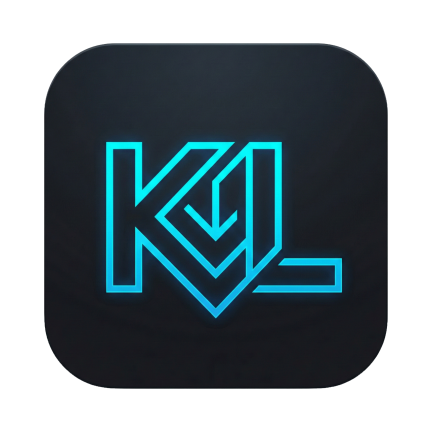
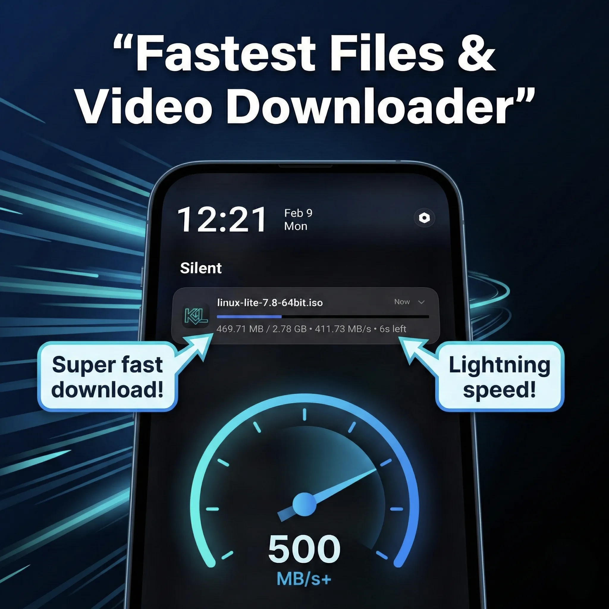
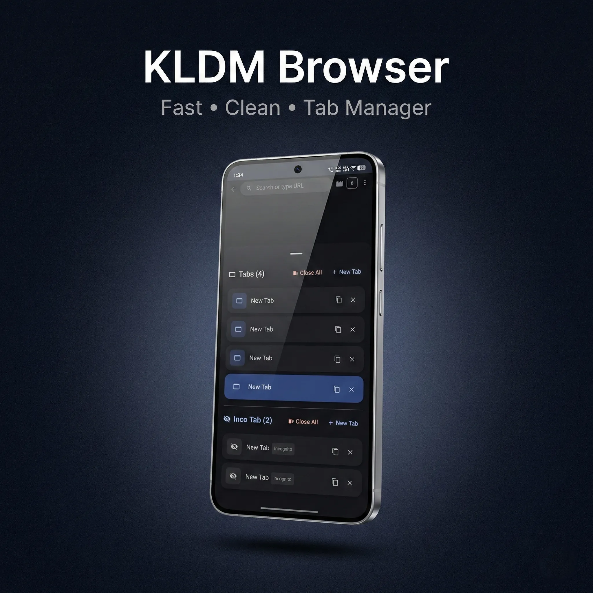

<div align="center">
  
  <h1>🚀 KL Download Manager (KLDM)</h1>
  <p><strong>A production-grade, ultra-fast Android Download Manager, Video Downloader & Adblock Privacy Browser built with Jetpack Compose & Material 3.</strong></p>

  <p>
    <a href="https://kldm.coinloot.in/"></a>
    <a href="https://play.google.com/store/apps/details?id=com.kestlogic.kldownloadmanager"></a>
  </p>
  <p>
    
    
    
    
    
    
    
  </p>
</div>

---

<p align="center">
  <b>KL Download Manager (KLDM)</b> is the ultimate all-in-one <b>video downloader</b>, <b>audio downloader</b>, and <b>fast file manager</b> app for Android. Experience lightning-fast downloads with our advanced <b>multi-thread segmented download engine</b>, and browse the web securely using our built-in <b>Privacy Browser</b> with an integrated adblocker. Designed entirely with <b>Material You (Material 3)</b>, KLDM offers an unparalleled, aesthetic, and fluid user experience optimized for seamless <b>background downloading</b>.
</p>

---

## 📑 Table of Contents

- [✨ Highlights & Features](#-highlights--features)
- [📱 Screenshots](#-screenshots)
- [🏗️ Architecture Overview](#️-architecture-overview)
- [🛠️ Technology Stack](#️-technology-stack)
- [📁 Project Structure](#-project-structure)
- [🧩 Module Overview](#-module-overview)
- [⚡ Download Engine](#-download-engine)
- [🌐 Browser Engine](#-browser-engine)
- [🎨 UI & Screens](#-ui--screens)
- [🛡️ Play Policy & Security Compliance](#️-play-policy--security-compliance)
- [🗺️ Roadmap & Project Status](#️-roadmap--project-status)
- [🚀 Download & Installation](#-download--installation)
- [📜 License](#-license)

---

## ✨ Highlights & Features

| 🚀 **Fast Download Engine**                            | 🌐 **Adblock Privacy Browser**                         |
| ---------------------------------------------------- | ---------------------------------------------------- |
| • **Multi-threaded & Segmented Downloads**           | • Built-in **Adblock Engine** & popup blocker        |
| • Smart URL sniffing & auto-capturing                | • **Resource Detection Pipeline** (video/audio sniff)|
| • Pause, Resume, and Auto-retry capabilities         | • Advanced **Tab Management** & Session Restore      |
| • Background downloading via Foreground Services     | • Incognito mode with strict privacy enforcement     |
| • Concurrent download limits & Global speed control  | • Per-host site settings (JS, Desktop mode, Dark mode)|
| • Adaptive concurrency & segment engine              | • Popup & navigation guard protection                |

| 📁 **Smart File Manager & Video Downloader**           | 🎨 **Premium UI & Architecture**                       |
| ---------------------------------------------------- | ---------------------------------------------------- |
| • **Media Detector:** Auto-find videos on any page   | • Ultra-smooth **Jetpack Compose** interface         |
| • **Audio Downloader:** Save music tracks easily     | • Beautiful **Material 3 / You** dynamic theming     |
| • Easy file categorization & secure storage          | • **Offline-first** Room DB persistent storage       |
| • Clipboard monitoring & auto-capturing              | • Edge-to-Edge display with elegant animations       |
| • SAF (Storage Access Framework) integration         | • Clean Architecture + **MVVM** + **MVI** patterns   |
| • APK install detection & security warnings          | • **Hilt** dependency injection across all modules   |

---

## 📱 Screenshots

<div align="center">
  
  &nbsp;&nbsp;
  
  &nbsp;&nbsp;
  
</div>

*Note: Screenshots above feature the dynamic Material You theming and edge-to-edge UI spanning the entire system.*

---

## 🏗️ Architecture Overview

KLDM follows **Clean Architecture** principles with a strict **multi-module** Gradle setup. Each module has clearly defined responsibilities and boundaries, ensuring high testability, maintainability, and scalability.

```
┌─────────────────────────────────────────────────────────┐
│                    🎨 Presentation Layer                │
│         (Jetpack Compose UI • ViewModels • Navigation)  │
│                      [ :app module ]                    │
├─────────────┬───────────────────────────┬───────────────┤
│  📥 Download│    🌐 Browser Engine      │  📊 Data      │
│    Engine   │  (WebView • Adblock •     │   Layer       │
│ (Segments • │   Detection • Media)      │ (Room • DAO • │
│  Queue •    │  [ :browser-core ]        │  DataStore)   │
│  Storage)   │                           │ [ :data ]     │
│[:download-  │                           │               │
│  core]      │                           │               │
├─────────────┴───────────────────────────┴───────────────┤
│                  🔧 Common / Shared                     │
│       (Domain Models • Utilities • Constants)           │
│                    [ :common module ]                   │
└─────────────────────────────────────────────────────────┘
```

**Key Architectural Patterns:**

| Pattern | Usage |
|---------|-------|
| 🏛️ **Clean Architecture** | Strict separation of UI, domain, and data layers |
| 📐 **MVVM + MVI** | Unidirectional data flow with StateFlow & Compose |
| 💉 **Hilt DI** | Constructor injection across all modules |
| 🔄 **Repository Pattern** | Multiple repositories abstracting data sources |
| ⚡ **Kotlin Coroutines + Flow** | Fully reactive async processing |
| 🗃️ **Offline-First** | Room DB as single source of truth |

---

## 🛠️ Technology Stack

Built with modern Android development practices to ensure high performance, maintainability, and scalability.

| Category | Technology |
|----------|-----------|
| 🟣 **Language** | [Kotlin](https://kotlinlang.org/) — 100% Kotlin codebase |
| 🎨 **UI Framework** | [Jetpack Compose](https://developer.android.com/jetpack/compose) with Material 3 / Material You |
| 🏛️ **Architecture** | Clean Architecture + MVVM + MVI Concepts |
| 💉 **Dependency Injection** | [Hilt](https://dagger.dev/hilt/) (with KSP compiler) |
| 🗄️ **Database** | [Room](https://developer.android.com/training/data-storage/room) (with auto-migrations & schema versioning) |
| ⚙️ **Preferences** | [DataStore](https://developer.android.com/topic/libraries/architecture/datastore) (Preferences) |
| 🌐 **Networking** | [OkHttp](https://square.github.io/okhttp/) (Custom segmented download engine) |
| ⚡ **Async Processing** | Kotlin Coroutines & Flows |
| 📋 **Background Tasks** | Android WorkManager & Foreground Services |
| 🧪 **Serialization** | [Kotlinx Serialization](https://github.com/Kotlin/kotlinx.serialization) |
| 🎬 **Media Playback** | [Media3 (ExoPlayer)](https://developer.android.com/media/media3) — HLS, DASH, Progressive |
| 🌍 **Web Engine** | AndroidX WebKit (WebView) |
| 📂 **Storage** | SAF (Storage Access Framework) + DocumentFile |
| 🏎️ **Startup** | Baseline Profiles + ProfileInstaller |
| 🛡️ **Build Optimization** | R8 full mode, ProGuard, resource shrinking, ABI splits via AAB |
| ☕ **JVM Target** | JVM 21 with Core Library Desugaring |
| 📦 **Build System** | Gradle (Kotlin DSL) with Version Catalogs |

---

## 📁 Project Structure

```text
KL-Download-Manager/
│
├── 📱 app/                     # Presentation layer — Compose UI, Navigation, ViewModels
│   ├── ui/
│   │   ├── screens/            # Full-screen Compose destinations
│   │   ├── components/         # Reusable Compose UI components
│   │   ├── browser/            # Browser-specific UI components
│   │   ├── navigation/         # Navigation graph & transitions
│   │   ├── viewmodel/          # State management (MVVM/MVI)
│   │   ├── theme/              # Material You theming system
│   │   └── onboarding/         # First-run setup experience
│   └── init/                   # App startup initialization
│
├── 📥 download-core/           # Download engine module
│   ├── engine/                 # Multi-segment & single-stream downloaders
│   ├── manager/                # Download orchestration & queue system
│   ├── storage/                # SAF-based storage layer
│   ├── notification/           # Download progress notifications
│   ├── probe/                  # URL probing & header analysis
│   ├── recovery/               # Interrupted download recovery
│   ├── streaming/              # Streaming download support
│   └── service/                # Foreground download service
│
├── 🌐 browser-core/            # Privacy browser engine module
│   ├── adblock/                # Network & cosmetic ad-blocking engine
│   ├── detection/              # Resource Detection Pipeline (video/audio)
│   ├── media/                  # HLS/DASH stream parsing & metadata
│   ├── manager/                # Tab lifecycle & session management
│   ├── popup/                  # Popup blocking & navigation guards
│   ├── protection/             # Privacy protection enforcement
│   └── webview/                # WebView configuration
│
├── 🗄️ data/                    # Data persistence module
│   ├── dao/                    # Room Data Access Objects
│   ├── entity/                 # Database entity definitions
│   ├── repository/             # Repository pattern implementations
│   ├── db/                     # Database setup & migrations
│   └── prefs/                  # DataStore preferences
│
└── 🔧 common/                  # Shared foundation module
    ├── model/                  # Domain models & enums
    └── util/                   # Shared utilities & constants
```

---

## 🧩 Module Overview

### 📱 `:app` — Presentation Layer

The main application module hosts the **Jetpack Compose** UI, navigation, and all ViewModels. It follows a single-activity architecture with `MainActivity` as the sole entry point.

**Key Screens:**
- 🏠 **Downloads** — Active/completed downloads with batch operations
- 🌐 **Browser** — Full-featured privacy browser with tab management
- 📁 **Files** — Downloaded file management & organization
- ➕ **Add Download** — URL input, header config, segment picker
- ⚙️ **Settings** — Comprehensive app configuration
- 🛡️ **Adblock Settings** — Granular ad-blocking controls
- 🔒 **Privacy Dashboard** — Privacy metrics & statistics
- 📜 **History** & **Bookmarks** — Browsing data management

---

### 📥 `:download-core` — Download Engine

The heart of KLDM. A custom-built, production-grade HTTP download engine with **multi-segment parallel downloading**, bandwidth control, and robust error recovery.

```
                  ┌─────────────────────┐
                  │  🎛️ DownloadManager │ ← Central orchestrator
                  └──────────┬──────────┘
                             │
             ┌───────────────┼───────────────┐
             ▼               ▼               ▼
    ┌────────────┐  ┌─────────────┐  ┌──────────────┐
    │ 📋 Queue   │  │ ⏰ Scheduler│  │ 🔄 Recovery  │
    │ Controller │  │             │  │   Engine     │
    └──────┬─────┘  └─────────────┘  └──────────────┘
           │
           ▼
    ┌─────────────────┐    ┌──────────────────────┐
    │ 🔀 MultiSegment │    │ 📥 SingleStream      │
    │ Downloader      │    │ Downloader (fallback) │
    └──────┬──────────┘    └──────────────────────┘
           │
    ┌──────┼──────────────────┐
    ▼      ▼                  ▼
 [Seg 1] [Seg 2] ... [Seg N]  ← Parallel segments via OkHttp
    │      │                  │
    └──────┼──────────────────┘
           ▼
    ┌─────────────────┐    ┌──────────────────┐
    │ 💾 SAF Storage  │    │ 🔔 Notifications │
    │ Layer           │    │ System           │
    └─────────────────┘    └──────────────────┘
```

**Engine Features:**

| Feature | Description |
|---------|-------------|
| 🔀 **Multi-Segment** | Splits files into N segments, downloads in parallel via OkHttp HTTP range requests |
| 🧠 **Smart Downloads** | Analyzes server capabilities (Accept-Ranges, Content-Length) to choose optimal strategy |
| 📋 **Queue System** | Priority-based queue with configurable concurrent download limits |
| 🏎️ **Speed Limiting** | Token-bucket algorithm for global bandwidth control |
| 📦 **Buffer Pooling** | Reusable byte buffers to reduce GC pressure during high-throughput downloads |
| 🔄 **Adaptive Engine** | Dynamically adjusts segment concurrency based on server connection limits |
| 💾 **SAF Storage** | Full Storage Access Framework compliance with scoped storage |
| ⚔️ **Conflict Resolution** | Intelligent duplicate file handling with rename/overwrite/skip options |
| 🔔 **Notifications** | Rich progress notifications with speed, ETA, and per-download controls |
| ♻️ **Recovery** | Auto-resume interrupted downloads after network/app restarts |

---

### 🌐 `:browser-core` — Privacy Browser Engine

A full-featured privacy-focused browser engine built on AndroidX WebKit with advanced ad-blocking and media detection capabilities.

| Feature | Description |
|---------|-------------|
| 🛡️ **Network Adblock** | EasyList-compatible filter engine blocking ads at the network level |
| 🎨 **Cosmetic Filters** | CSS selector-based element hiding for visual ad removal |
| 🔍 **Resource Sniffing** | JavaScript injection to detect downloadable resources on any page |
| 🎬 **HLS/DASH Parsing** | Built-in manifest parsers for streaming content detection |
| 📑 **Tab Management** | Multi-tab browsing with session persistence & restoration |
| 🕶️ **Incognito Mode** | Process-isolated incognito with strict data separation |
| 🚫 **Popup Blocking** | Multi-layer popup defense with JS interception & navigation guards |
| ⚙️ **Site Settings** | Per-domain settings for JavaScript, desktop mode, dark mode |
| 📸 **Media Capture** | Session-based media capture with deduplication |
| 🔒 **Privacy Protection** | Cookie isolation, tracking protection, secure browsing enforcement |

---

### 🗄️ `:data` — Persistence Layer

Manages all persistent data using **Room** database with schema versioning and **DataStore** for preferences.

**Database Tables:**
```
📊 Room Database
├── 📥 downloads        ← Download tasks with metadata, status, progress
├── 🧵 segments         ← Individual download segment tracking
├── 🔖 bookmarks        ← Browser bookmarks with folders
├── 📜 history          ← Browsing history with timestamps
├── 📋 headers          ← Cached HTTP headers for downloads
└── ⚙️ site_settings    ← Per-host browser settings (JS, dark mode, desktop UA)
```

**DataStore Preferences:**
- 🎨 Theme preferences (light/dark/system, dynamic color)
- ⚙️ Download defaults (thread count, speed limits, auto-retry)
- 🛡️ Privacy settings (incognito defaults, tracking protection)
- 🌐 Browser preferences (default search engine, homepage)

---

### 🔧 `:common` — Shared Foundation

Shared domain models, utilities, and constants used across all modules:

- 📐 **Domain Models** — Download status, categories, priorities, storage modes, theme modes
- 🔧 **Utilities** — URL parsing, MIME type resolution, size/speed formatting, segment configuration, structured logging

---

## 🎨 UI & Screens

KLDM features a rich set of **full-screen composables** and **reusable components**, all built with Jetpack Compose and Material You:

### 📺 Screens

| Screen | Description |
|--------|-------------|
| 🌐 **Browser** | Full browser with address bar, tabs, resource detection |
| ➕ **Add Download** | Download configuration with header editor & segment picker |
| ⚙️ **Settings** | Comprehensive settings with categorized sections |
| 📁 **Files** | File explorer with sorting, filtering, batch operations |
| 📥 **Downloads** | Active/queued/completed downloads with inline controls |
| 🛡️ **Adblock Settings** | Adblock filter management & whitelist controls |
| 📊 **Download Details** | Per-download details, segments, speed graph |
| 🔐 **Site Settings** | Per-host browser settings configuration |
| 🔒 **Privacy Settings** | Privacy preferences & data management |
| 🛡️ **Privacy Dashboard** | Privacy statistics & blocked tracker metrics |
| 🔎 **Diagnostics** | Internal diagnostics & debug tools |
| 🔖 **Bookmarks** | Bookmark management with folders |
| 📜 **History** | Browsing history with search & delete |

### 🧩 Reusable Components

> Sheets, dialogs, pickers, and specialized UI elements shared across screens:

- 📥 **Add Download Sheet** — Bottom sheet for quick download initiation
- ⚔️ **File Conflict Dialog** — Smart duplicate file resolution
- 🧵 **Threads Picker** — Segment count selection with visual preview
- 🔋 **Battery Optimization Card** — Battery optimization guidance
- 📋 **Downloads Overflow Menu** — Batch action controls
- 🔗 **Webpage Link Fallback Dialog** — Fallback link handling
- 🎨 **M3 Components** — Material 3 design system components
- 📐 **Compact Components** — Compact layout variants

---

## 🛡️ Play Policy & Security Compliance

KL Download Manager takes user safety and Google Play Store policies strictly:

- ✅ **No YouTube Downloads:** Strictly blocks YouTube URLs to comply with terms of service.
- ✅ **Privacy First:** Explicit permissions asked only when required, no unauthorized tracking.
- ✅ **Secure Browsing:** The built-in browser isolates incognito sessions and blocks intrusive ads.
- ✅ **No DRM Bypass:** KLDM respects copyright and avoids downloading protected content.
- ✅ **Scoped Storage:** Full SAF compliance — no legacy storage permissions required.
- ✅ **Foreground Service Transparency:** `dataSync` type properly declared for download services.
- ✅ **Data Safety:** Complete data safety declaration for Play Store transparency.
- ✅ **Edge-to-Edge:** Modern Android 15+ display compliance with proper system bar handling.

---

## 🗺️ Roadmap & Project Status

KLDM is built iteratively in phases. Current version: **v1.1.7** (Build 17)

| Phase | Milestone | Status |
|-------|-----------|--------|
| 📦 **Phase 1-2** | Clean Architecture Setup & Core Single-stream HTTP Downloader | ✅ Complete |
| 🔀 **Phase 3** | Multi-threaded Segmented Downloading & Speed Limits | ✅ Complete |
| 🌐 **Phase 4-5** | Privacy Browser Integration & Core Resource Sniffer | ✅ Complete |
| 🎨 **Phase 6-7** | Application Polish, SAF Integration & Clipboard Monitoring | ✅ Complete |
| 🔍 **Phase 8-9** | Resource Detection Pipeline, Media Preview & Host Settings | ✅ Complete |
| 🚀 **Phase 10** | Final Polish & Performance Optimizations | ✅ Complete |
| 📱 **Phase 11-14** | Browser Productivity Pack, Streaming Support & Media Playback | ✅ Complete |
| ⚡ **Phase 15-17** | Pause/Resume Fixes, Video Detection Refinement | ✅ Complete |
| 🔐 **Phase 19-20** | Authenticated Downloads & Session Header Support | ✅ Complete |
| 🧵 **Phase 22-24** | Segment Cancellation Fix, Speed Optimization & Server Resilience | ✅ Complete |
| 🏪 **Phase 25+** | Google Play Store Release, User Feedback & Iteration | 🔄 In Progress |

---

## 🚀 Download & Installation

KL Download Manager is a proprietary, closed-source application designed to provide the best downloading & file management experience on Android.

You can download the official release from:

<div align="center">

| Platform | Link |
|----------|------|
| 🌐 **Official Website** | **[kldm.coinloot.in](https://kldm.coinloot.in/)** |
| 📱 **Google Play Store** | **[Download on Play Store](https://play.google.com/store/apps/details?id=com.kestlogic.kldownloadmanager)** |

</div>

> ⚠️ *This is not an open-source project. The source code and repository are private.*

---

## 📊 Stats at a Glance

<div align="center">

| Metric | Value |
|--------|-------|
| 📦 **Modules** | 5 (app, download-core, browser-core, data, common) |
| 🎯 **Min SDK** | 30 (Android 11) |
| 🎯 **Target SDK** | 36 |
| 📦 **Current Version** | 1.1.7 (Build 17) |
| 🟣 **Language** | 100% Kotlin |
| 🎨 **UI** | Jetpack Compose + Material You |
| 🏛️ **Architecture** | Clean Architecture + MVVM + MVI |

</div>

---

## 📜 License

Copyright © 2026 KestLogic Solutions. All rights reserved.

This software is proprietary and confidential. Unauthorized copying, distribution, or modification of this software, via any medium, is strictly prohibited.

---
<div align="center">
  <sub>Developed with ❤️ by KestLogic. Optimizing the way you download on Android.</sub>
  <br/>
  <sub>🌐 <a href="https://kldm.coinloot.in/">kldm.coinloot.in</a> • 📱 <a href="https://play.google.com/store/apps/details?id=com.kestlogic.kldownloadmanager">Play Store</a></sub>
</div>
